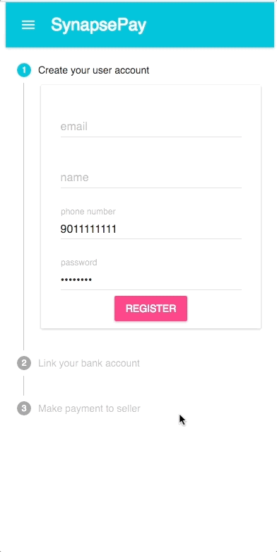

# sPay
A payment portal using SynapseFI API following the Marketplace Flow. This mobile friend app allows you to easily pay the vendor through an intuitive flow. 

React + Redux 

Node + Express

### How to use
Follow onscreen instruction and fill out the necessary forms. 
Values are prepopulated for easy testing and are editable. 

### Setup

#### setup server
```
$ cd /path/to/dir
$ yarn install
```
#### setup client
```
$ cd client
$ yarn install
```
#### run app
```
$ cd ..
$ yarn dev
```

Supports [`Redux DevTools Chrome Extension`](https://chrome.google.com/webstore/detail/redux-devtools/lmhkpmbekcpmknklioeibfkpmmfibljd)

### Demo



## TODOs

- [ ] Deploy to Heroku
- [ ] Add form validation for all fields
- [ ] Add error alerts; currently error is logged to console
- [ ] Add more tests